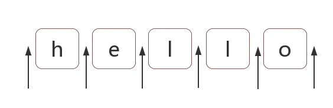

# 第二章 正则表达式位置匹配攻略

> 正则表达式是匹配模式，要么匹配字符，要么匹配位置

## 1. 位置

位置是相邻字符之间的位置



## 2. 如何匹配位置

在 ES5 中，共有 6 个锚字符：

```bash
^
$
\b
\B
(?=p)
(?!p)
```

2.1 ^ 和 \$
| | |
| ----- | :-----: |
| ^ | 匹配开头，在多行匹配中匹配行开头 |
| \$ | 匹配结尾，在多行匹配中匹配行结尾 |

```bash
# 匹配开头和结尾
"hello world".replace(/^|$/g, '啊啊啊啊啊');
// "啊啊啊啊啊hello world啊啊啊啊啊"
```

2.2 \b 和\B
| | |
| ----- | :-----: |
| \b | 单词边界 |
| \B | 非单词边界 |

\b 是单词边界，具体就是\w 和\W 之间的位置，也包括\w 和^之间的位置，也包括\w 和\$之间的位置
\B 就是\b 的反面的意思，非单词边界。例如在字符串中所有位置中，扣掉\b，剩下的都是\B 的

```bash
'[JS] Lesson_01.mp4'.replace(/\b/g,'啊啊啊啊啊');
// "[啊啊啊啊啊JS啊啊啊啊啊] 啊啊啊啊啊Lesson_01啊啊啊啊啊.啊啊啊啊啊mp4啊啊啊啊啊"
'[JS] Lesson_01.mp4'.replace(/\B/g,'啊啊啊啊啊');
// "啊啊啊啊啊[J啊啊啊啊啊S]啊啊啊啊啊 L啊啊啊啊啊e啊啊啊啊啊s啊啊啊啊啊s啊啊啊啊啊o啊啊啊啊啊n啊啊啊啊啊_啊啊啊啊啊0啊啊啊啊啊1.m啊啊啊啊啊p啊啊啊啊啊4"
```

2.3 (?=p)和(?!p)
| | |
| ----- | :-----: |
| ?=p | p 前面的位置 |
| ?!p | 不是 p 前面的位置 |

```bash
"hello".replace(/(?=l)/g, '啊啊啊啊啊');
// "he啊啊啊啊啊l啊啊啊啊啊lo"
"hello".replace(/(?!l)/g, '啊啊啊啊啊');
// "啊啊啊啊啊h啊啊啊啊啊ell啊啊啊啊啊o啊啊啊啊啊"
```

## 3. 位置的特性

位置,可以理解成空字符 '';

```bash
"hello" == "" + "h" + "" + "e" + "" + "l" + "" + "l" + "o" + "";
"hello" == "" + "" + "hello"
/^hello$ 等价于 /^^hello$$$/
```

## 4. 案例

4.1 不匹配任何东西的正则

```bash
/.^/
/$./
```

4.2 数字的千位分隔符表示法
把"12345678"，变成"12,345,678"
**注意:** 不匹配开头 ?!^

```bash
'123456789'.replace(/(?!^)(?=(\d{3})+$)/g,',');
// "123,456,789"
```

4.3 验证密码问题
密码长度 6-12 位，由数字、小写字符和大写字母组成，但必须至少包括 2 种字符。
| | |
| ----- | :-----: |
| (?=.\*[0-9]) | 任意字符串后有一数字 |
| (?=.\*[a-z]) | 任意字符串后有一小写字母 |

- 同时包含数字和小写字母
- 同时包含数字和大写字母
- 同时包含小写字母和大写字母
- 同时包含数字、小写字母和大写字母

```bash
let reg = /((?=.*[0-9])(?=.*[a-z])|(?=.*[0-9])(?=.*[A-Z])|(?=.*[a-z])(?=.*[A-Z]))^[0-9A-Za-z]{6,12}$/g;
reg.test("1234567"); // false
reg.test("abcdef"); // false
reg.test("ABCDEFGH"); // false
reg.test("ab23C"); // false
reg.test("ABCDEF234"); // true
```
